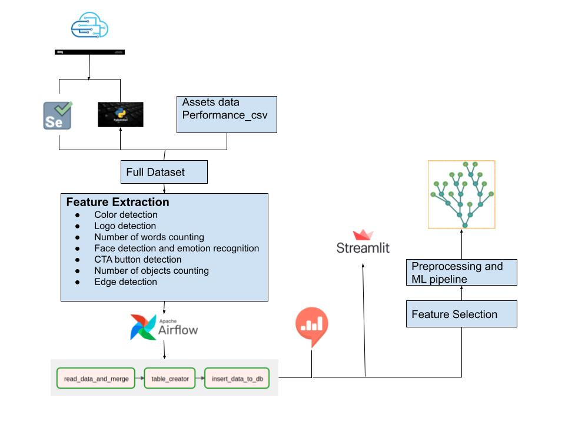

# Computer Vision For Creative Optimisation
## KPI Maximisation Through Image Analysis

Table of contents

- Overview
- Requirements
- Install
- Repository Structure
- Contrbutors

## Overview

</br>

<br/>

The aim of this project is to apply deep learning based computer vision techniques for creative optimization in mobile advertising. We will develop a deep learning based computer vision algorithm that segments objects from creative assets and relates them to KPI parameters of the corresponding campaigns in order to optimise creatives based on campaign performance data.

## Requirements
>Python
>
>Pip
>
>Pandas
>
>Torch
>
>Selenium
>
>OpenCV
>
>DVC
>
>Mlflow

## Install
1.Install the project
```
git clone https://github.com/reiten-g3-ad-challnage/computer-vision-for-creative-optimisation.git
cd computer-vision-for-creative-optimisation
pip install -r requirements.txt
```

## Repository Structure
```bash
├── .github/workflows(Github actions)
│   
├── data(Project data)
│   
├── log(Log file)
│
├── notebooks(Jupyter notebooks)
│
├── images(screenshots)
│
├── scripts(Python code)
│
├── tests(Unit tests)
│
├── README.md(Project information)
│
├── requirements.txt(Porject requirements)
```
## Contrbutors

- `Henok Desalegn`
- `Emtinan Osman`
- `Mohammed EsamAldeen`
- `Tegisty Hailay`
- `Haylemicheal Mekonnen ` 
- `Gedion Abebe`


